# Volleyball E-Store Design Documentation

## Team Information
* Team name: Nonchalant
* Team members
  * Colby Lewis
  * Ben Cerrone
  * Ethan Patterson
  * Zach Conway
  * Noah Pangilinan

## Executive Summary

We will create a Volleyball E-Store website with a fully implemented frontend
and backend. The site will sell items like:
- Volleyball Nets
- Volleyballs
- Sneakers
- Knee-pads

The site will also have the ability to create custom Jerseys with a color, name, number, and picture of the customer's choice. 

Additionally, users can purchase lootboxes and win a variety of products from them. 

### Purpose

An E-Store where customers can purchase volleyball related products, order custom jerseys, and win products through the purchase of lootboxes. Store admins have full control over the product inventories to add, delete, or edit them. Admin also has control to delete users or remove products from their shopping carts. 


### Glossary and Acronyms

| Term | Definition |
|------|------------|
| Nonchalant | Our team name (A partial anagram of group member names ) |
| Frontend | The portion of the app the user sees and can interact with |
| Backend | The portion of the app the user does not see and handles functionality |
| Angular | Javascript Library that handles the frontend |
| REST API | A set of standards for interfacing with an application |
| Controllers and DAOs (Data Access Object)| Java classes that deal with sending information between the frontend and backend |
| Trello | Online Kanban board shared between group members |
| CURL Commands | Set of commands that allow sending of HTTP requests (get, create, delete, update, search) |


# Requirements

### Definition of MVP
- User can create and login to accounts
- User can browse or search a store inventory and add products from it to their cart
- User can view their shopping cart
- User can purchase the products in their shopping cart
- Admin can log in and view an admin dashboard 
- Admin can edit the product inventory in any way

### MVP Features
- Minimal Authentication
  - A user can create a new account
  - A user can log into their own previously made account
  - There is a reserved account called "admin"
    - "admin" has administrative capabilities
    - Reserved for store owner
  - Customers have unique, non-blank, usernames

- Customer Functionality
  - Customers can search for specific products
  - Customers are able to add products to their shopping cart
  - Customers can remove products from their shopping cart
  - Customers can purchase the products in their shopping cart

- E-Store Owner/Admin
  - Admin can add, remove, and edit product data in the inventory
  - Admin can delete users and products in a chosen user's shopping cart
  - Admin does not have access to a shopping cart

### Enhancements

##### Custom Jerseys
- Our first 10% enhancement is the ability for customers to create customer Jerseys. The Jerseys are fully customizable, and feature the ability to change the primary color, secondary color, number, and even the logo. 
  
- A preview of the Jersey is also shown upon pressing the View option. Once the Jersey is placed in the cart, the preview image will feature the custom logo.
  
- The E-Store owner has the ability to change the price of the Custom Jerseys

##### Lootboxes
- The second 10% feature enhacement in the Lootbox product. Customers have the option to buy a 'Lootbox' which is a item that will award them a random prize from a pool of products
  
- The Lootboxes come in a variety of different price categories. 
  
- The E-Store owner the ability to do the following:
  - Create new Lootbox
  - Delete a Lootbox
  - Change the price of a Lootbox
  - Change the pool of items in a Lootbox
  - Rename a Lootbox
  - Change the image for a Lootbox


- Once a user has selected the option to buy a Lootbox, they will be prompted to make sure that they are okay with trying their luck at winning a prize. After confirming their purchase, the Lootbox will open and award them their mystery prize.


- Prizes won from the Lootbox will be added the cart and their correct discounted price. This is because the products were already purchased, and thus they do not need to be checked out twice


## Application Domain


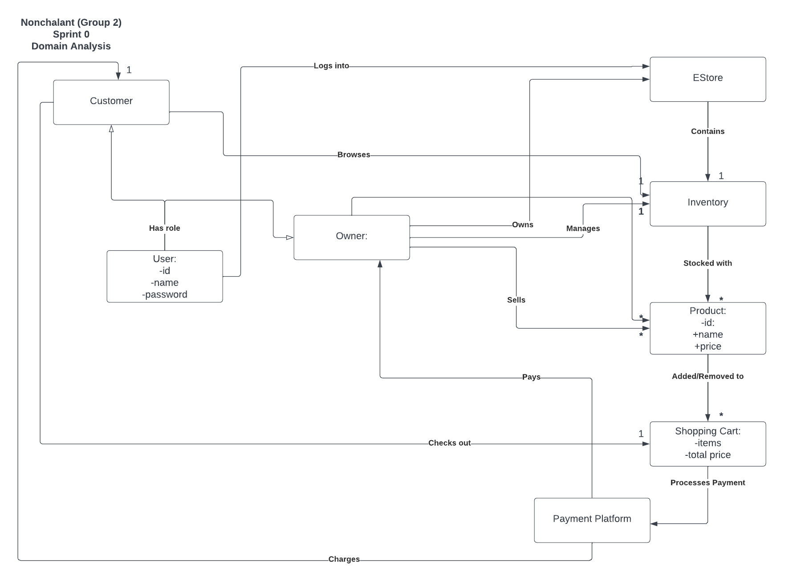


## Architecture and Design

This section describes the application architecture.


### Summary

The following Tiers/Layers model shows a high-level view of the webapp's architecture.


The e-store web application, is built using the Model–View–ViewModel (MVVM) architecture pattern. 

The Model stores the application data objects including any functionality to provide persistance. 

The View is the client-side SPA built with Angular utilizing HTML, CSS and TypeScript. The ViewModel provides RESTful APIs to the client (View) as well as any logic required to manipulate the data objects from the Model.

Both the ViewModel and Model are built using Java and Spring Framework. Details of the components within these tiers are supplied below.


### Overview of User Interface

This section describes the web interface flow; this is how the user views and interacts
with the e-store application.


#### User Interface and Navigation

##### Login
The first page a user sees when opening the site, it prompts users to choose one of three options:
- Login with existing account:
  - Requires a pre-existing account by username, so the user has created an account at some point in the past.
- Create new account:
  - User inputs a username and a new account under that name gets created. They can now log in using that username.
    - Trying to create an account using an existing username (admin or other existing account) is not a valid option.
- Login as guest:
  - Allows the user to view a limited version of the site 

Additionally, one can log in as administrator (via the username ADMIN) to access the admin view and abilities for the site.

##### Dashboard
 When logging in with a standard account, the user will be taken to the store's homepage.

 There is a navigation bar at the top of the page that will always be visible on the current page, containing various buttons:
  - Logout
    - Signs the user out and takes them back to the login page, prompting them to sign in again.
  - Dashboard
    - Takes the user to the main page with the featured products and search bar.
  - Products
    - Takes the user to a page where they can view available products and their prices/stock.
    - Admins can modify the product line here and set the pricing for custom jerseys.
  - Lootboxes
    - Takes the user to the lootbox purchasing page.
    - Admins can manipulate the available lootboxes and the products they may contain here.
  - Custom Jerseys
    - Takes the user to the custom jersey creator.
    - This button not visible to admins or guests.
  - Shopping Cart
    - Takes the user to their shopping cart.
    - This button not visible to admins or guests.
  - User List (Admin only)
    - Takes the admin to a list of all the existing user accounts.
    - Not visible to standard users or guests.

  These allow the user to always be able to access important pages from anywhere and never get lost while navigating the e-store. 

  On the dashboard page, the user can scroll down to see a list of "featured products" displaying some of the products available in the inventory. Below that is a search function where the user can input some text and any products with a matching/similar name will be brought up below.

  Clicking on a product in either the featured section or the search section will bring up an expanded view of its details.

##### Products
Clicking the Products button takes the user to this page, where a full list of all available products in the inventory are displayed.

Each product has the following details visible:
- Product name
- Image of product
- Price
- Add to cart button
  - Available to standard users only

Clicking on a product brings up a more expanded view of the product details, with the addition of the current inventory quantity for the product. 

Clicking add to cart adds the product to the user's shopping cart and decrements the quantity in inventory by 1. When a quantity reaches 0, it cannot be added to cart anymore. 

When an admin accesses this page, they have some additional features:
- Create new products
  - Fields to input name, image url, price, and quantity and a button to create the product
- Edit existing products
  - Clicking on an existing product brings up the detail menu as usual, but the admin can edit the details here, and click save to update them. 
- Delete products
  - Additional delete button for each product on the main product list
- Adjust custom jersey pricing
  - Section to adjust this is at the bottom, with a field to input a new price and a button to save it. 

##### Lootboxes
Clicking on this page brings up a list of all the available lootboxes.

Each lootbox has the following details visible:
- Lootbox name
- Image of the lootbox
- Price

Clicking on a lootbox brings up a detail view just like the one for products(minus quantity of course) and a purchase button. 

Pressing the purchase button brings up a confirmation prompt asking if the user is sure they want to purchase it. Upon confirmation a new window pops up letting the user know which products they won and the total worth. 

The products are then removed from the inventory and added to cart for a price of $0 as they have already been paid for. 

When an admin accesses this page, they have some additional features:
- Create new lootboxes
  - Fields to input name and price and a button to create the lootboxes
  - The other functions can be edited the same way a standard lootbox is edited
- Edit existing lootboxes
  - The detail menu accessed by clicking on a lootbox brings up many more options now:
    - Field to edit name
    - Field to edit price
    - Field to edit image URL
    - Prize pool control
      - The admin can see a checklist of all products in the inventory and choose which items the lootbox can pull from
    - Go back and save buttons to discard or save edits respectively
- Delete lootboxes
  - A delete button is added to the main page in the same way as the one for the products page

##### Custom Jerseys
Clicking on this page brings up the custom jersey designer. Once more, admins and guests cannot access this page. 

This page allows one to design and preview a custom jersey, and as such the following is available on the page:
- A series of fields allowing one to change the different aspects of a custom jersey:
  - A color dropdown to select the primary color
  - A color dropdown to select the secondary color
  - A text input field to enter the name that goes on the jersey
  - A numeric input field to enter the number that goes on the jersey
  - A text input field to enter a url for the logo that goes on the jersey
- Jersey price is displayed right below the fields
- Two buttons to interact with the page
  - A button to view the jersey with the currently selected options
  - A button to add it to the user's cart and reset the jersey maker
- A display where an image of the custom jersey with the user's input choices is shown

Another reminder that the price for these is dictated by the admin on the products page, so they have no access to the creator as there's no need. 

##### Shopping Cart
Clicking on this page displays a list of the products in the current user's shopping cart. As a reminder, this page is not visible to admins or guests. 

The shopping cart is split up into two sections of products:
- Standard products and lootbox winnings
- Custom orders

Standard products are displayed in a similar manner to the way they are on the product page but with a few differences. For each product, the following is shown:
- Product image
- Product name
- Current product price
- Quantity currently in cart
- A button to decrease the quantity in cart by 1
- A button to remove all of the product from the cart

Lootbox products are also shown here, just with a price of 0.

In another section below the normal product list, there is a section displaying the custom jersey orders currently in the cart. The following is displayed for each jersey:
- Chosen jersey image
- Chosen jersey name
- Current jersey price
- Chosen jersey number
- Chosen colors
- A button to remove the jersey from the cart

If either of these lists are empty, they will not display. If both are empty, a message notifying the user that their shopping cart is empty will appear. 

Below all the listed products is the cart functions:
- A display of the total price of everything in the cart
- A checkout button
- A go back button to close the shopping cart

Clicking the checkout button brings up a popup that asks the user if they would like to checkout and listing the total price they will be charged again. Once they confirm this, the cart empties and a checkout reciept appears listing the purchased items and the net total, which the user can close at their leisure. 

##### User List
Clicking on this button brings up a list of all the existing user accounts in the estore. Reminder that this button is only visible to admins and therefore can only be accessed by such. 

At the top of the page is a form to create new user accounts, where the admin can enter a username, press the add button, and add a new account to the estore. 

Below this is the total list of all user accounts on the estore with the following data visible:
- User id
- Username
- A button to delete the user

Clicking on a user account brings up a summary of all the items in the user's shopping cart. This nearly identical to the user shopping cart page, except the remove from cart buttons are not present, and there is no price total/checkout options of course. The admin can only view the products in a user's inventory, and can click a go back button on this page to return to the account list. 
Deleting a user with products in their cart puts them back in the inventory the same way as if the user removed the products from the cart manually.   

### View Tier

Our view tier consists of a comprehensive collection of diverse components and services that enhance the user experience. Upon landing on the site, the user is directed to the login component, which is among several components utilizing the CurrentUserService that contains information about the current user. Additionally, the UserService serves as a means to create new users. It is noteworthy that the admin has the option to log in as an administrator.

After logging in, the user is directed to the dashboard, which functions as a hub for the other components. The dashboard includes the search component that allows users to search for products. Products are represented as an interface and can be accessed through the ProductService, which has the methods to send HTTP requests to the backend.

Take, for instance, an admin adding a Product to the inventory:

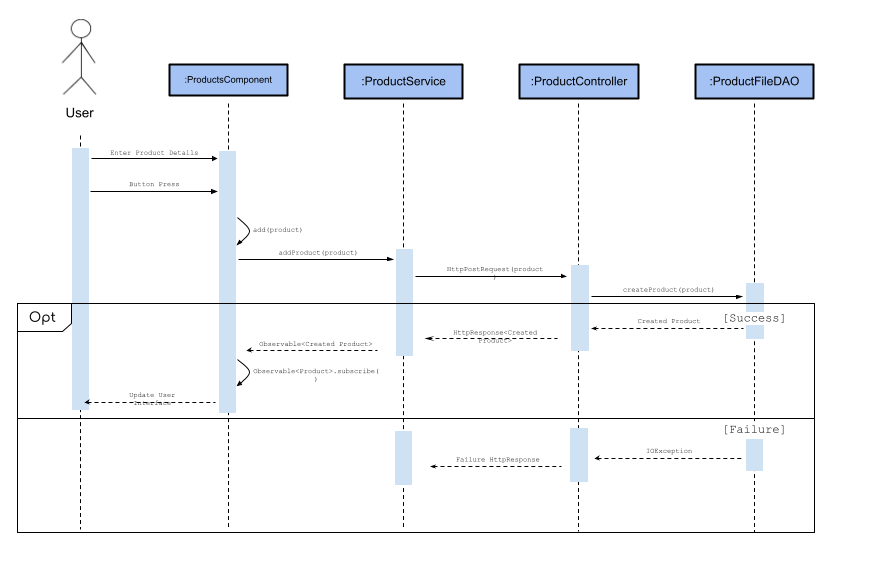

The products page, which is also a component that uses the ProductService, displays various products. Clicking on a product leads to the product detail page. From the products page, users can proceed to the shopping cart page, which utilizes the current user service. The shopping cart page is the shopping-cart component that also has the checkout ability.

One of our enhancements is the custom jersey page, which is the jersey-maker component. This component includes the jersey-image component, which is the formatting for displaying the custom jersey. Additionally, the jersey service performs HTTP requests to the backend in order to store the data for the completed custom jersey as well.

Creating a jersey for the User follows the following process, where you can see more clearly the additional methods that get called in the frontend upon successful addition of a jersey's information to the backend: 

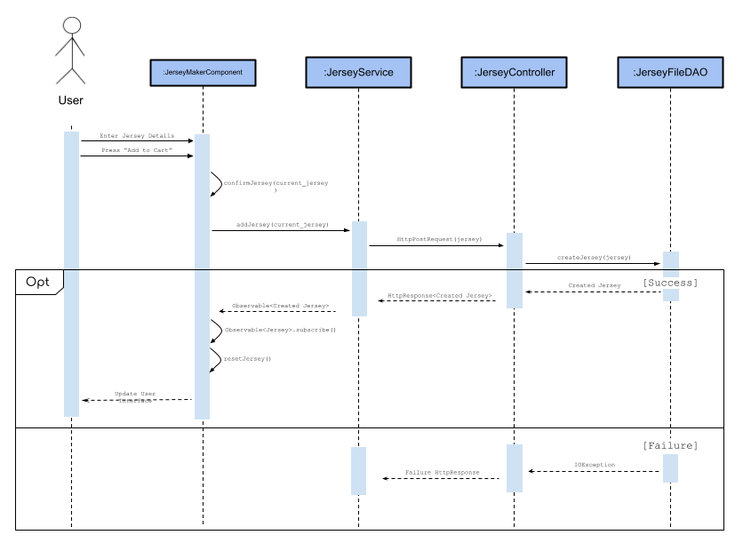

Upon successful addition, the observable's subscribe function runs, and then the jersey maker is reset to the default options, so the user can create another jersey. Note that this only happens on success though, and failure just returns a failure response in the HttpResponse.

Another enhancement is the lootboxes, which has a lootbox service that performs HTTP requests to the backend. The lootbox-detail component is the popup for the lootbox spinning.

Lastly, the users component allows the admin to modify user carts and remove users. It also utilizes the user service to remove users.

### ViewModel Tier

The ViewModel tier encompasses all of our controller classes, which act as a communication medium with the front end of our application. The UserController class is responsible for handling HTTP requests relating to the user class, while the ProductController class is responsible for handling HTTP requests to the products. Similarly, the JerseyController class manages HTTP requests to the custom jerseys, and the LootboxController handles requests concerning the lootboxes.

These controllers follow a uniform approach in their operation, where the class is designated as a RestController, and mapped to the respective endpoint (users, products, etc.). Each method in the class is mapped to a corresponding HTTP method (GET, POST, PUT or DELETE) through Spring annotations.


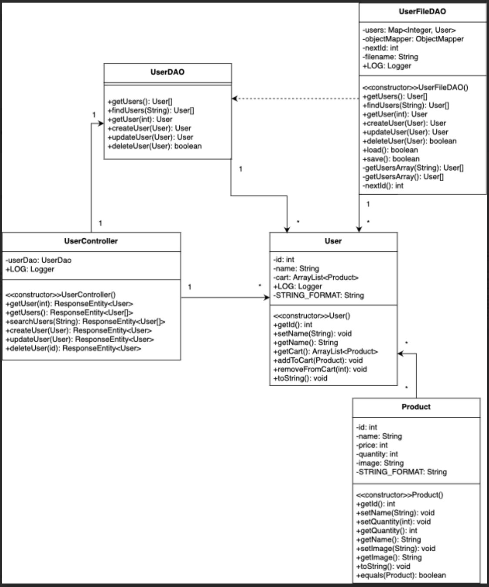
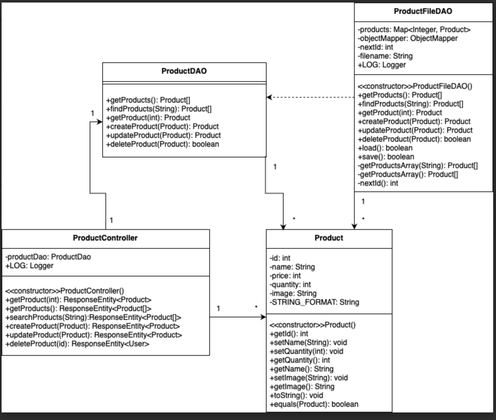
In the above diagrams, the ProductController and UserController are the ViewModel aspects, and the rest is part of the model. One can see how they have the ability to interact with the model, and fetch/perform actions for the view end without touching the raw data directly like the model does. 

### Model Tier


This e-store involves the implementation of several classes that form the basis of an e-store platform. The classes include Product, User, Lootbox, and Jersey, each with their own set of attributes such as ID, Name, Price, and Image. The classes also have getter and setter methods to retrieve and modify these attributes.

Additionally, the project includes DAO (Data Access Object) classes that provide an interface to move data between the classes. These DAO classes include ProductDAO, JerseyDAO, LootboxDAO, and UserDAO. All of these DAO classes have similar methods, and they are responsible for converting JSON script into their respective objects.

The Product class has attributes for the Name, Price, ID, and Image. The User class has attributes for the Name, ID, and Cart. The Lootbox class has attributes for the Name, ID, Price, Pool, and Image. The Jersey class has attributes for the ID, Creator, Primary Color, Secondary Color, Name, Logo, Price, and Number.


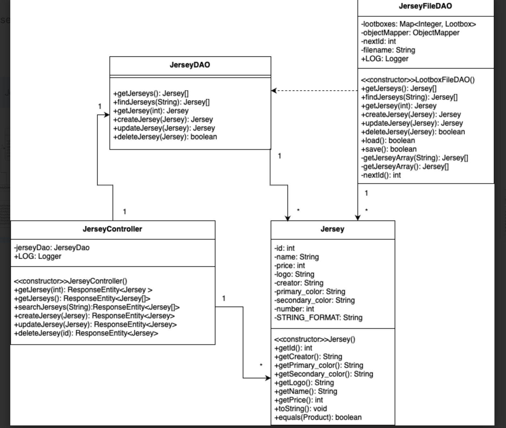
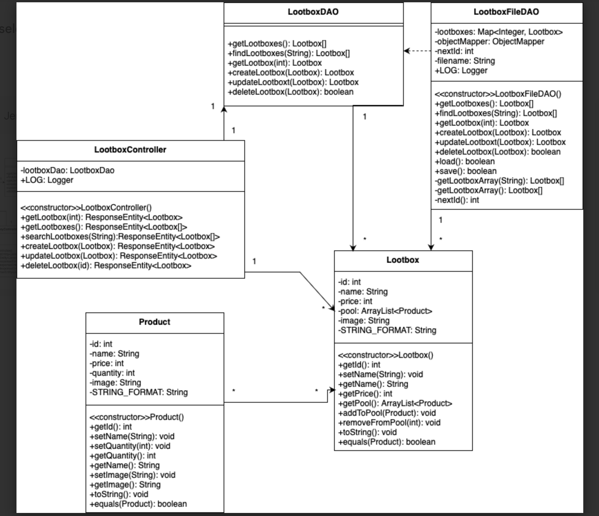
In the above diagrams, the Product, Jersey, Lootbox, JerseyDAO, LootboxDAO, JerseyFileDAO, and LootboxFileDAO are the model tier components. All their work is done on a set of json files with similar names foe each class(product.json, lootbox.json, etc), and their methods focus on manipulating this data through getter and setter methods as listed in the DAO interfaces/FileDAO classes. 

The JSON is converted to instances of the respective class, for example product.json turns into instances of the Product class in some sort of list to keep track of it. The FileDAO can modify these and then save/load them to and from the json file as needed. 

## OO Design Principles


### Low Coupling
  The classes and logic within the product are structured in such a way that their functionality and responsiblity of an object is contained without being intertwined with the logic of another object
  
  For example, the logic of the User.java and Product.java classes, they contain the constructors, getters and setters for their respective objects. User objects do not know about Product objects. Any interaction between the two classes are handled by another class, which has the sole responbility of interacting between these two classes.

  Additionally, the functionality for accessing data within the JSON file for Users and Products is not stored directly within the Product and User classes, since they that would increase coupling.

### Dependency Injection
Dependency Inversion/Injection involves a particular way of working with the dependencies of a class by defining the behavior you expect from the dependencies through interfaces then injecting the dependencies by reference. This process is implemented at several points in our program, with two major areas being services and the Data Access Objects. 

Services fulfill some functionality needed across multiple components in the frontend of the program. Instead of implementing this functionality within the classes itself and needing to alter large amounts of code when changes need to be made, an instance of the necessary service is instead injected into the component, allowing one instance of the service to be shared among all of the separate components.

Another significant instance of dependency injection is the Data Access Objects for products and users. The ProductDAO/UserDAO is an interface that promises some data storage functionality, and the ProductFileDAO/UserFileDAO actually implement the functionality of those interfaces using .json files. As a result, we can not only simulate the DAOs with a mock class for testing purposes, we can also swap out the implementation completely without having to change any code outside of the class being injected. 

Ultimately, while the extracted benefits from dependency injection primarily lie within code segregation and class mocking for testing purposes, this principle also serves to provide modularity and memory efficiency to larger systems.
### Controller
  The controller principle is exemplified by the service classes in our frontend and the controller classes in the backend. 

  The service classes are responsible for communication with the backend. This allows the frontend to fetch data such as the products being sold (through product.service.ts) and information about users (through users.service.ts). These send http requests to the backend which are handled by the controllers on that end. 

  The controller classes handle communication to and from the backend. For instance our product controller class handles http requests made on product objects such as GET/POST. Then in the frontend we are able to send these requests via the product service. 

  This works to separate the frontend from the backend, allowing logic related to the model itself to be isolated from the user interface, which only fetches that  information as necessary for the display. 


### Pure Fabrication
  Pure Fabrication refers to use of services to access certain capabilities and let those capabilities be reused where it is needed in the program. Our frontend implements these explicitly in the form of Angular service classes that provide certain reusable functionality throughout the program. 

  The ProductService class in product.service.ts handles requests to fetch and manipulate data related to products being sold and distributes this functionality to components that require it, such as the product-list and product-search. 

  The UserService class handles requests related to user data, which is primarily necessary for logging in and creating new users. 

  The CurrentUserService class retains information regarding the user currently logged in, and provides an intermediary channel to the UserService class allowing for requests specifically related to the currently logged-in user. 

  LootboxService and JerseyService follow along much in the footsteps of the two services defined above as well, but focusing on the data required for their specific pages/purposes

  By isolating this behavior to these services, we can reuse the functionality they provide in the frontend, especially in regards  to communication with the backend.


## Static Code Analysis/Future Design Improvements

In: src/main/java/com/estore/api/estoreapi/persistance/UserFileDAO.java on line 236 we don't use the string.equals() method to compare and as a result get a high severity bug. In order to correct this we should use .equals() instead of ==.
```java
for (User x : getUsersArray()) {
    System.out.println(x.getName());
    if(x.getName() == name){
        return x;
    }	
}
```
\
In: src/main/java/com/estore/api/estoreapi/model/Product.java on line 102 we don't ever explicity override the method and as a result get a high severity bug. To correct this we should use @overide above the method or rename the method to something else.
```java
public boolean equals(Product input) {
    return (id==input.getId());
}
```
\
In: src/app/jersey-maker/jersey-maker.component.css on line 48, though this is a specific example this issue is in a lot of our css code. We are duplicating css in a lot of our files this could be easily prevented by removing it or better yet having a better style for css/html templates.
```css
cursor: pointer;
```

There was a lot of talk among our group that we wanted to better handle a lot of the logic and push more of the logic into the backend. This is not to say that all the logic is the frontend, in fact all of our quantity checks & sanity checks (i.e negative price) on the data are preformed there.
## Testing
- Testing was done for every class in the **model** portion of the project
- The testing showed that all of the backend functionality works properly
- All test passed without any failing
- JUnit was used for all tests
- Their is a large disparity between the low number of frontend tests compared with the high number of backend tests
  - This is because of the way the project is structured, where the frontend is only displaying the logic that is present within the backend. Testing the frontend would involve having to test for the presence of things on the webpage itself, and that means the only thing that could be tested is if things are being send back and forth properly

### Acceptance Testing

#### Sprint 4
- There are 11 User stories that have all of their acceptance criteria met.
- There are currently no user stories that are missing completed acceptance criteria.
- There are no currently no user stories that are yet to be tested.

#### Sprint 2
- There are 16 User stories that have all of their acceptance criteria met.
- There are currently no user stories that are missing completed acceptance criteria.
- There are no currently no user stories that are yet to be tested.

### Unit Testing and Code Coverage

Our unit testing strategy was to good good coverage & make sure we hit all of our bases with the unit tests. Our goal was 90% for each tier - which we hit across the board. Aside from the couple of missed instructions in the model (product) section as well as a missed branch in the model (lootbox) section we had 100% coverage. 

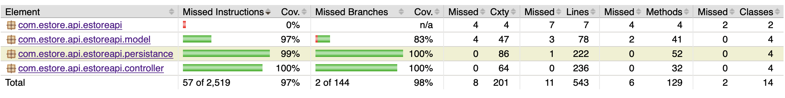

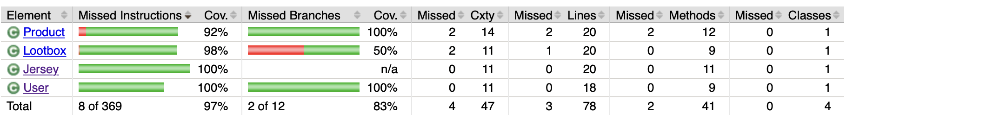

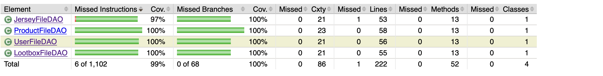

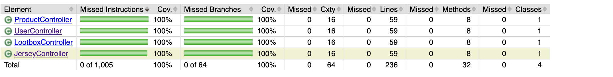 

## Design Decisions and Problem Solutions
- Shopping cart will be implemented as an array of products within the User class.
- Any changes from the frontend to the backend involving the shopping cart will have to go through the User functionality.
- Our 10% feature will be Loot Crates and Custom Jerseys.
- The Lootboxes will need their own FileDAO and DAO files.
  - Created, needed fields for name, image, price, and an array of products for the lootpool.
- Products won from lootboxes will be added to the cart with a cost of $0 as the lootboxes were already "purchased" separately.
  - This special variant of the products with a unique price uses a different ID than the default product, the original but negative, as it still needs to pull data from the product, but shouldn't be merged with that one quantity wise. 
- The Custom Jerseys will need their own FileDAO and DAO files separate from products.
  - Created, stores data from all user input fields along with an ID of the user who created it, and are displayed in a separate list in the cart instead of with the products. 
- Custom Jerseys need a way to display the customization options without bloating the project size. 
  - This was accomplished through layering images of the different jersey components (colors and logo), as well as text boxes for name and number placed right where they would go on the jersey. This simulates a model of what the jersey would look like but using HTML elements as a workaround.
- Inventory will need to be live updated when products are added to the cart, and vice versa.
  - Accomplished through use of .subscribe(); to process the changes to the backend and then re-initializing the page to update the values on the page for inventory/cart quantity. 
- Updating a product as an admin in the inventory will need to update the product data for the copy of the product in the user carts.
  - Accomplished through scanning all the carts and sending update requests for users alongside an updated cart to match the changes.
  - Involved making decisions on how quantity changes are to be handled when the admin decreases the quantity to an amount less than what is currently in user carts. 